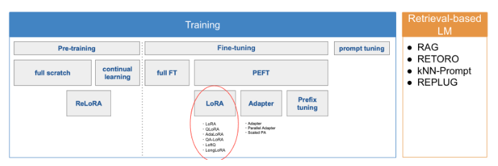

# お勉強用メモ
備忘録的なやつ

## Few-Shot プロンプティング
Few-shotプロンプティングとは、**モデルに対して事前にいくつかの例を提示**し、結果を導き出す方法を学習させるプロンプトのこと。ChatGPTを含むLLMは、十分に学習されておりZero-Shotプロンプティングでも良い結果が得られることがあるが、プロンプトでいくつかの例（Few-Shot）を与えるFew-Shotプロンプティングを採用することで、より精度の高い結果が期待できる。
## Chain of Thought プロンプティング
中間的な推論ステップを設けてあげたり、仮説を示してやってLLMが考える文脈を準備することらしい。数学の問題とかはこれで結構精度が上がるらしい。
## LLMでのドキュメント検索
### エンジン検索
ドキュメントやそのメタデータをインデックス化してそれを検索する方法
### ベクトル検索
データ(文書)とプロンプトを全てベクトル化し、その類似度に基づいて検索する方法。具体的なベクトル化の手法としてはEmbeddingとかいうやつがあるらしい。類似度を確認するときはコサイン類似度が使われがち。
https://qiita.com/sakabe/items/5f14999ded1de087c9b5
## トークンとは
### 単語トークン
その名の通り単語の単位
### 文字トークン
単語の意味の単位を加味せず、１文字ずつ分割された単位
### サブワードトークン
文字と単語の中間くらいの単位らしい。こういう単位に分割する代表的な方法にByte-Pair Encoding（BPE）やSentencePieceなどがある。ちなみにGPTシリーズはこの方法を使っている。日本語はトークンが多くなりがちなのもこの辺が絡んでるとかなんとかだと思う。

## PaLM2
google様が開発した大規模言語モデル。
Codey for Code Generationなど派生も多く、コード生成っぽい話題が多め。

## GPT一般
学習データの教師の有無の話とか。
https://qiita.com/omiita/items/c355bc4c26eca2817324

## いろんなfine-tuningの話
https://tech.preferred.jp/ja/blog/llm-fine-tuning-for-domain-knowledge/

LangChain、LlamaIndexといった重みに手を加えない方法論はあるが、事前学習に含まれない知識を扱うには少し難がある。

事前学習データにない特定の知識を活用する方法は大きく分けて３つ
* Retrieval-based LM
* 再学習
* 外部ツールの活用(LangChain、LlamaIndex)  
  
などがある。外部ツールの話はさておき、大きくは以下の分類となる。

### PEFT(Perammeter Efficient Fine Tuning)
一部パラメータだけをFTつするアプローチ。F-FTの対義語だと思っていい。

Adapter以外は原著論文とかもhuggingfaceにまとまってる。

https://github.com/huggingface/peft

### LoRA
[3]で言われている「事前学習モデルは大量のパラメータ数にもかかわらず、低い固有次元を持ちFine-tuningに有効な低次元のパラメータ化も存在する」という主張を踏まえ、重みの更新の固有次元も低いという仮説のもとで、低ランク行列だけで学習する手法。

事前学習された大規模言語モデルの重み行列を構成するすべての重みをファインチューニングする代わりに、この大規模行列を近似する2つの小さな行列をファインチューニングする。これらの行列がLoRAアダプターを構成する。このファインチューニングされたアダプタが事前学習済みモデルにロードされ、推論に使用される。

空間全体にランダムに射影された200個の学習可能なパラメータのみを最適化することで、F-FTの90％の性能を達成した論文もある。

**原著論文：https://arxiv.org/abs/2106.09685**

### Adapter
事前学習済みモデルの外部に追加されるサブモジュール。事前学習済みモデルのパラメータは凍結し、Adapter部分のパラメータだけ更新すればいいのでtransformer部分への影響がない。ただし、Transformerの出力をAdapterが入力として受け取り出力を返す必要があるため推論に時間がかかる傾向にある。

**原著論文っぽいもの：https://arxiv.org/pdf/1902.00751.pdf**

## instraction tuning
よくわからん。。。https://arxiv.org/abs/2109.01652
